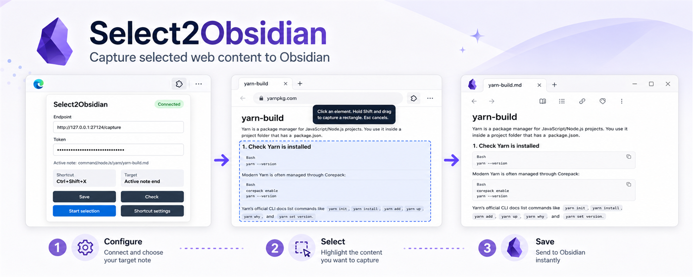

# Select2Obsidian



Select2Obsidian is a two-plugin workflow:

- A Chromium MV3 extension for Chrome or Microsoft Edge lets you press `Ctrl+Shift+X`, choose part of the current web page, and send it as Markdown.
- An Obsidian companion plugin listens on `127.0.0.1:27124` and appends the Markdown to the end of the active Markdown note, or prompts for a target when no note is active.

## Project Layout

```text
chrome-extension/   Browser extension source, load unpacked in Chrome or Edge
obsidian-plugin/    Obsidian companion plugin source
tests/              Unit tests for shared behavior
```

## Build

```powershell
npm install
npm run build
npm test
npm run package:obsidian
```

The browser extension is plain Chromium MV3 JavaScript and can be loaded directly from `chrome-extension/` in Chrome or Microsoft Edge.

Privacy policy:

- https://tyzzt.github.io/select2obsidian/privacy/

The Obsidian plugin build writes `main.js`, `manifest.json`, and `styles.css` into `obsidian-plugin/`. The release package command also copies those three files into `dist/obsidian-release/` for GitHub Releases.

## Install the Browser Extension

Chrome:

1. Open `chrome://extensions`.
2. Enable Developer mode.
3. Choose **Load unpacked** and select `chrome-extension/`.

Microsoft Edge:

1. Open `edge://extensions`.
2. Enable Developer mode.
3. Choose **Load unpacked** and select `chrome-extension/`.

The default token is shared by both sides, so a fresh install works without pairing. If you generate a new token in Obsidian, paste the same token into the extension popup.

The default shortcut is `Ctrl+Shift+X`. Chrome may require changing or confirming it at `chrome://extensions/shortcuts`; Edge uses `edge://extensions/shortcuts`.

## Install the Obsidian Plugin

1. Run `npm run build`.
2. Copy or symlink `obsidian-plugin/` into your vault at `.obsidian/plugins/select-to-note/`.
3. Enable the plugin in Obsidian community plugin settings.
4. The default token already matches the browser extension. You can generate a new token and copy it into the extension popup if needed.

## Obsidian Community Release

This repository includes the root `manifest.json`, `versions.json`, `README.md`, and `LICENSE` expected by the Obsidian community plugin review flow. To prepare a release:

```powershell
npm run typecheck
npm test
npm run package:obsidian
```

Create a GitHub Release whose tag matches the version in `manifest.json`, then upload:

- `dist/obsidian-release/main.js`
- `dist/obsidian-release/manifest.json`
- `dist/obsidian-release/styles.css`

## Privacy and Network Use

The Obsidian plugin starts a local HTTP receiver bound to `127.0.0.1` while enabled. It accepts authenticated requests from the companion Chrome or Microsoft Edge extension and writes the received Markdown into the selected vault target.

Select2Obsidian does not include telemetry, analytics, advertising, account login, or any remote service. The plugin does not upload note content or browser selections anywhere. The shared token is stored locally in Obsidian plugin data and browser extension storage.

## Usage

1. Open an Obsidian Markdown note if you want the clip to be appended there.
2. In Chrome or Edge, press `Ctrl+Shift+X`.
3. Click the extension icon to check the Obsidian connection, update endpoint/token, or start selection.
4. Use `Ctrl+Shift+X` when you want to skip the popup and start selection directly.
5. Click a highlighted element, or hold `Shift` and drag a rectangle.
6. The selected content is appended to the end of the active Markdown note with source URL and capture time.

If no Markdown note is active, Obsidian shows a target picker. You can create a new clipping in `Clippings/` or append to an existing Markdown file.
