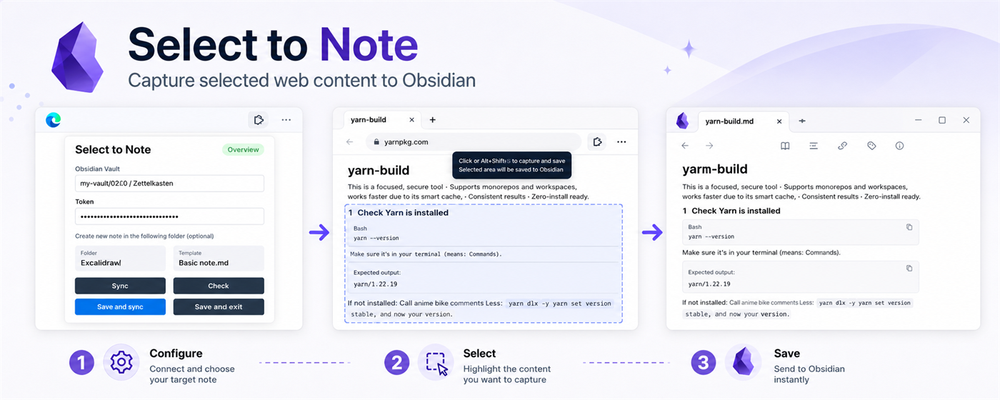

# Select to Note



<p align="center">
  <a href="#english"><strong>English</strong></a>
  ·
  <a href="#chinese"><strong>中文</strong></a>
</p>

<a id="english"></a>

## English

Select to Note clips selected browser content into Obsidian through a local companion workflow.

- The browser extension works in Chrome and Microsoft Edge. Press `Ctrl+Shift+X`, click a page element, or hold `Shift` and drag a rectangle.
- The Obsidian plugin listens on `127.0.0.1:27124`, verifies a shared token, and appends captured Markdown to the active note. If no Markdown note is active, it asks where to save the clipping.

## Install

### Obsidian Plugin

Install Select to Note from the Obsidian community plugin browser:

- https://obsidian.md/plugins?id=select-to-note

### Browser Extension

Download the browser extension ZIP from the latest GitHub release:

- https://github.com/TYzzt/select2obsidian/releases/latest/download/select-to-note-browser-extension.zip

Chrome:

1. Unzip `select-to-note-browser-extension.zip`.
2. Open `chrome://extensions`.
3. Enable **Developer mode**.
4. Choose **Load unpacked** and select the unzipped folder.

Microsoft Edge:

1. Unzip `select-to-note-browser-extension.zip`.
2. Open `edge://extensions`.
3. Enable **Developer mode**.
4. Choose **Load unpacked** and select the unzipped folder.

The default token is shared by both sides, so a fresh install works without pairing. If you generate a new token in Obsidian, open the browser extension **Settings** page and paste the same token there.

The default shortcut is `Ctrl+Shift+X`. Chrome manages extension shortcuts at `chrome://extensions/shortcuts`; Edge uses `edge://extensions/shortcuts`.

## Usage

1. Install and enable the Select to Note Obsidian plugin.
2. Install the browser extension.
3. Open the extension popup and choose **Check connection**.
4. Click **Start selection**, or press `Ctrl+Shift+X`.
5. Click a highlighted element, or hold `Shift` and drag a rectangle.
6. Choose **Send to Obsidian**. The selected content is appended to the active Markdown note with source URL and capture time.

If no Markdown note is active, Obsidian shows a target picker. You can create a new clipping in `Clippings/` or append to an existing Markdown file.

## Advanced Settings

The browser extension **Settings** page contains the local Obsidian endpoint and shared token. Most users can keep the defaults. Change them only if the Obsidian plugin uses a different endpoint or you generated a new token.

Translation is optional and requires your own Baidu Translate App ID and secret. When enabled, translation actions appear under **More** after selecting page content.

If the popup shows **Offline**, open Obsidian, enable the Select to Note plugin, and check again. If it shows **Token mismatch**, paste the Obsidian plugin token into the browser extension Settings page.

## Build

```powershell
npm install
npm run typecheck
npm test
npm run package:obsidian
npm run package:browser
```

The Obsidian release command writes `main.js`, `manifest.json`, and `styles.css` into `dist/obsidian-release/`. The browser package command writes `dist/select-to-note-browser-extension.zip`.

## Project Layout

```text
chrome-extension/   Browser extension source
obsidian-plugin/    Obsidian companion plugin source
tests/              Unit tests for shared behavior
docs/               Privacy policy and lightweight public docs
```

## Privacy and Network Use

The Obsidian plugin starts a local HTTP receiver bound to `127.0.0.1` while enabled. It accepts authenticated requests from the companion Chrome or Microsoft Edge extension and writes the received Markdown into the selected vault target.

Select to Note does not include telemetry, analytics, advertising, account login, or any remote service. The plugin does not upload note content or browser selections anywhere. The shared token is stored locally in Obsidian plugin data and browser extension storage.

Privacy policy:

- https://tyzzt.github.io/select2obsidian/privacy/

---

<a id="chinese"></a>

## 中文

<p align="center">
  <a href="#english"><strong>English</strong></a>
  ·
  <a href="#chinese"><strong>中文</strong></a>
</p>

Select to Note 可以把浏览器中选中的网页内容剪藏到 Obsidian。本项目由两部分组成：浏览器扩展和 Obsidian 社区插件。

- 浏览器扩展支持 Chrome 和 Microsoft Edge。按 `Ctrl+Shift+X` 后，可以点击网页元素，也可以按住 `Shift` 拖拽矩形框选。
- Obsidian 插件在本机 `127.0.0.1:27124` 启动接收端，校验共享 token 后，把 Markdown 追加到当前活动笔记末尾。没有活动 Markdown 笔记时，会弹窗让你选择或新建目标文件。

## 安装

### Obsidian 插件

在 Obsidian 社区插件市场安装 Select to Note：

- https://obsidian.md/plugins?id=select-to-note

### 浏览器扩展

从最新 GitHub Release 下载浏览器扩展 ZIP：

- https://github.com/TYzzt/select2obsidian/releases/latest/download/select-to-note-browser-extension.zip

Chrome：

1. 解压 `select-to-note-browser-extension.zip`。
2. 打开 `chrome://extensions`。
3. 开启 **开发者模式**。
4. 点击 **加载已解压的扩展程序**，选择解压后的文件夹。

Microsoft Edge：

1. 解压 `select-to-note-browser-extension.zip`。
2. 打开 `edge://extensions`。
3. 开启 **开发人员模式**。
4. 点击 **加载解压缩的扩展**，选择解压后的文件夹。

默认 token 已经在浏览器扩展和 Obsidian 插件里配好，首次安装可以直接使用。如果你在 Obsidian 插件设置中生成了新 token，请打开浏览器扩展 **Settings** 页面，把同一个 token 填进去。

默认快捷键是 `Ctrl+Shift+X`。Chrome 的快捷键管理地址是 `chrome://extensions/shortcuts`，Edge 是 `edge://extensions/shortcuts`。

## 使用

1. 安装并启用 Select to Note Obsidian 插件。
2. 安装浏览器扩展。
3. 打开浏览器扩展 popup，点击 **Check connection**。
4. 点击 **Start selection**，或按 `Ctrl+Shift+X`。
5. 点击高亮元素，或按住 `Shift` 拖拽矩形框选。
6. 点击 **Send to Obsidian**。内容会以 Markdown 形式追加到活动笔记末尾，并保留来源 URL 和捕获时间。

如果当前没有活动 Markdown 笔记，Obsidian 会弹出目标选择器。你可以新建到 `Clippings/`，也可以追加到已有 Markdown 文件。

## 高级设置

浏览器扩展 **Settings** 页面包含本地 Obsidian endpoint 和共享 token。大多数用户保留默认值即可。只有当 Obsidian 插件使用了不同 endpoint，或你生成了新 token，才需要修改。

翻译是可选高级功能，需要你自己的百度翻译 App ID 和 secret。启用后，选择网页内容时，翻译动作会出现在 **More** 里。

如果 popup 显示 **Offline**，请打开 Obsidian，启用 Select to Note 插件后重新检查。如果显示 **Token mismatch**，请把 Obsidian 插件里的 token 粘贴到浏览器扩展 Settings 页面。

## 构建

```powershell
npm install
npm run typecheck
npm test
npm run package:obsidian
npm run package:browser
```

Obsidian 打包产物位于 `dist/obsidian-release/`，浏览器扩展 ZIP 位于 `dist/select-to-note-browser-extension.zip`。

## 隐私和网络

Obsidian 插件只监听本机 `127.0.0.1`，浏览器扩展通过共享 token 发送剪藏内容。Select to Note 不包含遥测、分析、广告、账号登录或远程服务，不会上传你的笔记内容或浏览器选区。
